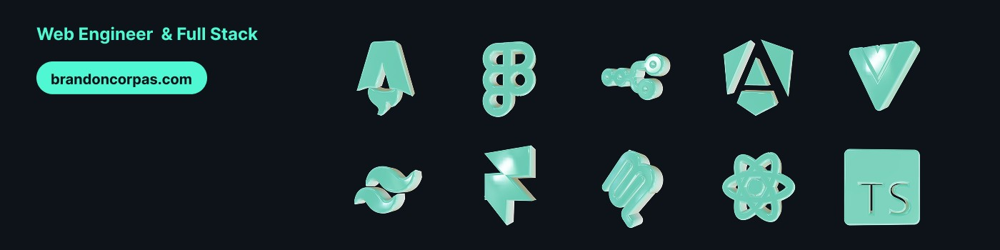

# My personal web portfolio

Learn about my work and experience gained from more than 3 years working with real companies in Colombia.



## ✨ Features

- **Client-side Actions** - Built with Astro's and Railway
- **Responsive Design** - Mobile-first responsive personal portfolio
- **Social Integration** - Optional social media links with icons
<!-- - **Type-safe Configuration** - Environment variables with Astro's env schema -->
<!-- - **Error Handling** - Comprehensive client and server-side validation -->

## 🚀 Quick Deploy

Deploy to Railway: [Railway](https://railway.com/) 

## 📋 Manual Setup

1. **Clone and install:**

   ```bash
   git clone https://github.com/corpasdev/portfolio-personal-v2.git
   cd portfolio-personal-v2
   npm install
   ```

2. **Configure environment:**

   ```bash
   cp .env.example .env
   ```


3. **Start developing:**
   ```bash
   npm run dev
   ```

## 📚 Built With

- [Astro](https://astro.build) - Web framework
- [Motion React](https://motion.dev/docs/react) - Animation library
- [TailwindCss](https://tailwindcss.com/docs/installation/using-vite) - Css framework
- [Lucide React](https://lucide.dev/guide/packages/lucide-react) - Icon library

## 📄 License

MIT License - feel free to use for your projects!